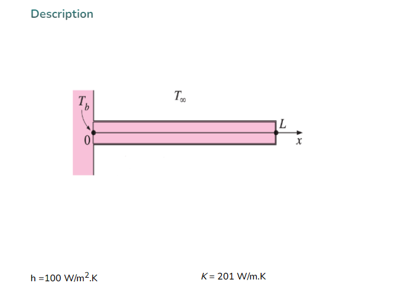
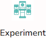
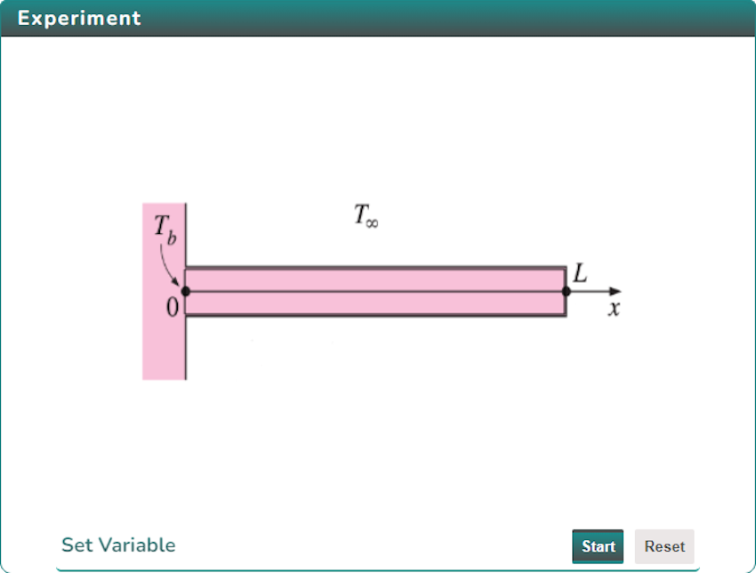
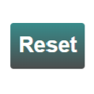
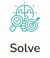
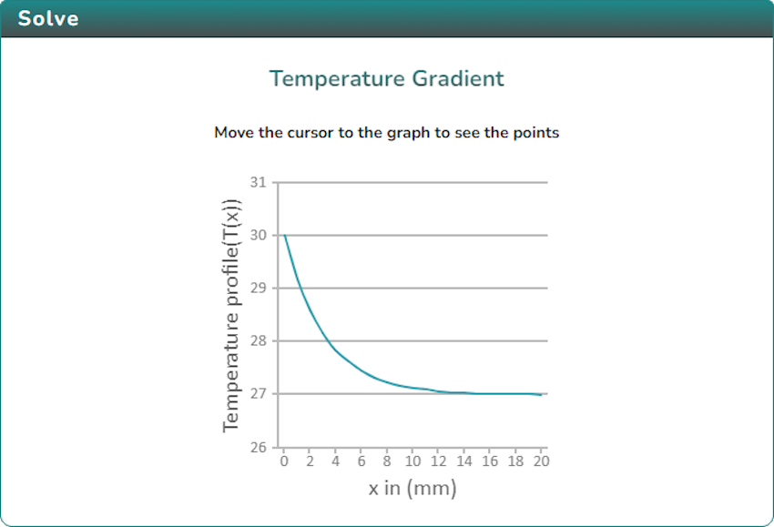
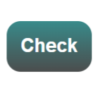

### Procedure

  Click on the Objective icon   to view the Objective of the simulation. 

   
   
   Click on the Description icon   to view the description of the simulation. 

   

  Click on the Experiment icon   to view the experimental setup. 

   

   Update the variables using the slider and click on the Start button  to perform the experiment. click Reset button  to reset the experiment. 
<!-- 
    -->

  After performing the experiment, click on the Solve icon  

   

  Calculate the result and click Check button  to Evaluate the result.

