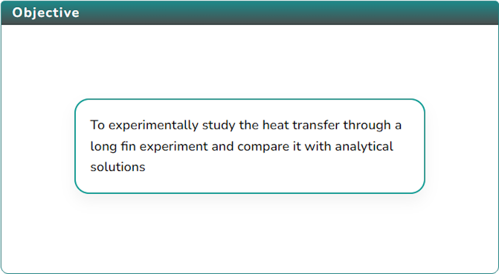
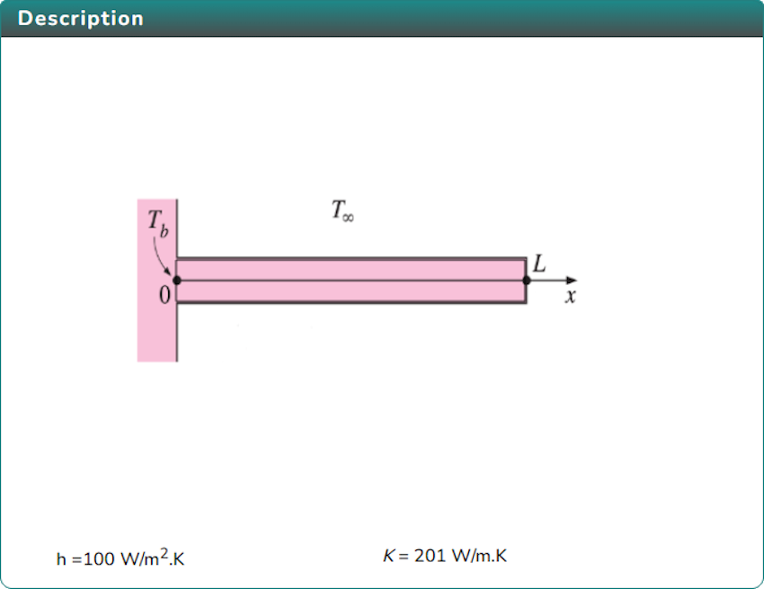
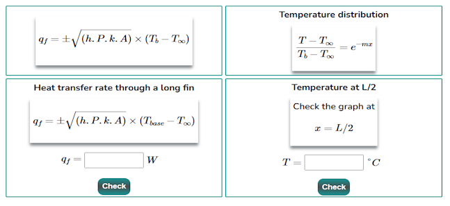

### Procedure

1. Click on the Objective icon   to view the Objective of the simulation.

   

2. Click on the Description icon  to view the description of the simulation.

   

3. Click on the Experiment icon  to view the experimental setup.

   

4. Update the variables using the slider and click on the Start button  to perform the experiment. click Reset button  to reset the experiment.

<!--
    -->

5. After performing the experiment, click on the Solve icon 

   

6. Calculate the result 

   

7. click the  Check button  to Evaluate the result.
