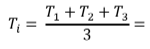
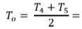

1. Clicking on the simulation tab will open the simulator where the water sump will be filled.

2. Set the appropriate voltage and click on the 'Set' button. This will lock the voltage and the apparatus can be starte by clicking the flashing 'play button'.
3. Click on the next button to go to the next page where the results  are displayed.

Click on the reset button to restart the experiment.