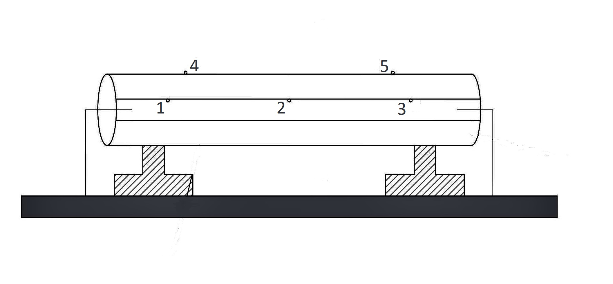

Heat transfer through conduction is a phenomenon in which heat is transferred from one region to another due to the temperature difference. This form of heat transfer favors metals more when compared with liquids. 

Convection, a dominating phenomenon in liquids, is due to the difference in the density of the adjacent layers. The liquid layer closer to the heat source will have less density when compared with the layer far from the source. The layer with the higher density will collapse on itself and push the layer with the lower density toward the top; this continues till the temperature inside the container is constant, and the source is disconnected, i.e., at equilibrium.

In this experiment, the water is flowing in a steady state (for this experiment, assume mw at a rate of 1.66x10-4 kg/s) in the water sump, as shown in Fig. 1. 

Figure 1. Experimental Setup to determine thermal conductivity of liquids

The heat input is adjusted by setting an appropriate voltage. After some intervals, the temperature becomes constant with the thermocouple readings. After achieving a steady state, the temperature at the top of the liquid layer  (T1) and bottom of the liquid layer (T2) is noted, which gives the temperature difference. 

The experimental setup consists of:
1.	Brass Plates
2.	Heater Coil
3.	Voltmeter
4.	Power supply
5.	Water Sump
6. Thermocouples

Formulae:
1. Heat Loss qw = mw x C pw x (Ti -  T0)  (Watts) ;  Specific Heat capacity of water C pw
2. Thermal conductivity of liquid K = qw /(A &delta;T/&delta;X);  &delta;X = Thickness of water film