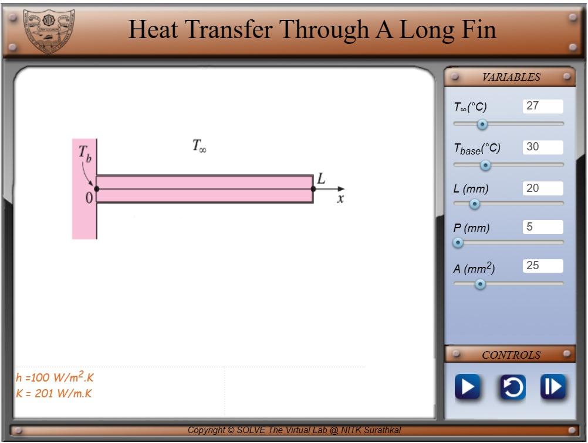
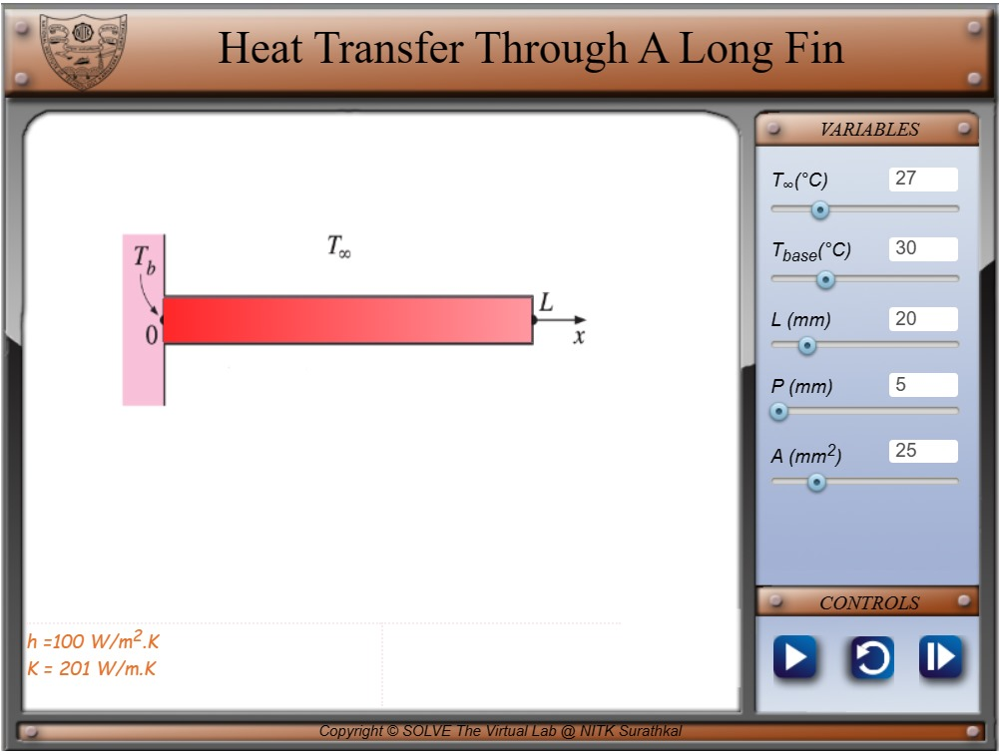

#### These procedure steps will be followed on the simulator

1. The following slide appears after clicking on the simulation, vary the different parameters in the variables section. 

   

2. Click play, wait for 5 seconds to reach the steady state, and click next. 

   

3. Finally, check the calculated values by entering them in their respective boxes. Click back if you want to go back to the previous slide.  

   
